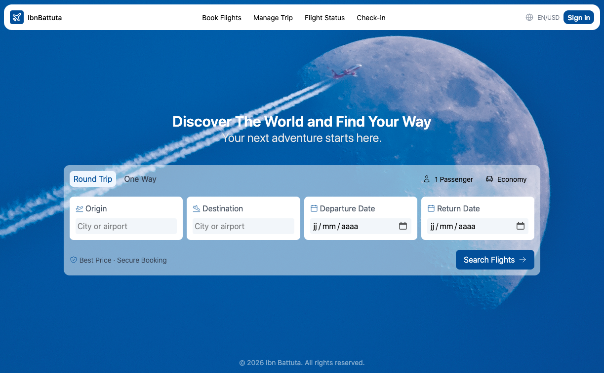
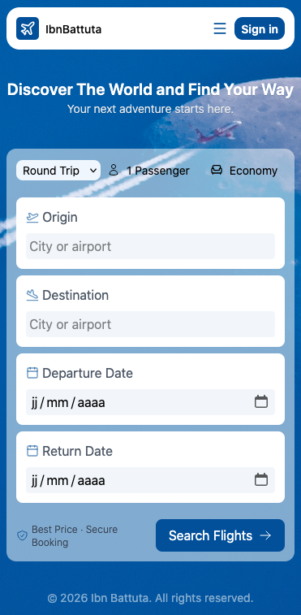

# ✈️ Ibn Battuta

>A responsive travel web application built with **React 19**, **Vite**, and **Tailwind CSS v4** — created as a practice project to explore modern Tailwind CSS patterns while building a real-world travel interface.


[](https://ibnbattutatravel.netlify.app)


---

## 🔗 Live Demo
[ibnbattutatravel.netlify.app](https://ibnbattutatravel.netlify.app)

---

## Preview

| **Desktop** | **Mobile** |
|---|---|
|  |  |


---

## Overview

Ibn Battuta is a travel web application inspired by modern travel and airline booking platforms. It includes:

- A **header** with logo, nav links, language selector, and sign-in button
- A **hero section** with headline and call-to-action copy
- An interactive **flight search form** — round-trip / one-way toggle, passenger count, cabin class, origin/destination fields, and date pickers, with fully responsive layouts across mobile, tablet, and desktop breakpoints
- A simple **footer** with a dynamic copyright year

## Tech Stack

| Tool | Purpose |
|---|---|
| [React 19](https://react.dev) | UI components |
| [Vite 8](https://vite.dev) | Dev server & build tool |
| [Tailwind CSS v4](https://tailwindcss.com) | Styling (via `@tailwindcss/vite` plugin) |
| [ESLint](https://eslint.org) | Linting (flat config, React Hooks + Refresh plugins) |
---

## Getting Started

### Requirements
- Node.js
- npm

### Installation

1. Clone the repository
```bash
git clone https://github.com/MedBuilds/ibn-battuta.git
```

2. Navigate to the project folder
```bash
cd ibn-battuta
```

3. Install dependencies
```bash
npm install
```

4. Start the development server
```bash
npm run dev
```

5. Open your browser at:
```
http://localhost:5173
```

---

## Project Structure

```
ibn-battuta/
├── public/
│   └── ibn-battuta-logo.svg     # Favicon / logo
├── src/
│   ├── assets/
│   │   └── background-image.webp # Hero background
│   ├── components/
│   │   ├── Copyright.jsx
│   │   ├── FlightSearch.jsx
│   │   ├── Footer.jsx
│   │   ├── Header.jsx
│   │   └── Hero.jsx
│   ├── App.jsx
│   ├── main.jsx
│   ├── index.css
│   └── App.css
├── index.html
├── vite.config.js
├── eslint.config.js
└── package.json
```

## Notes & Known Limitations

This is a **practice/UI project**, not a functional booking system:

- The "Search Flights" form has no backend — submitting it doesn't do anything yet.
- Nav links ("Book Flights", "Manage Trip", etc.) are placeholders (`#`).

---

## Author
**MedBuilds**
Full-Stack Developer in training
GitHub: [@MedBuilds](https://github.com/MedBuilds)